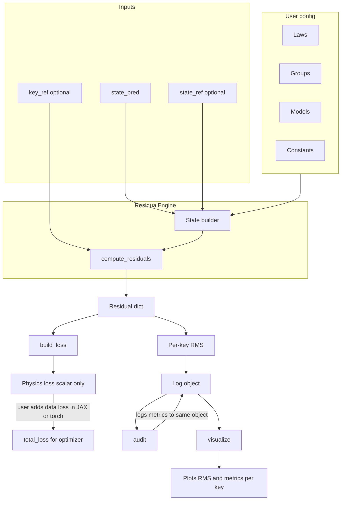

# moju: Physics-AI supervision for engineering-grade simulations

```bash
pip install moju
```

**moju** helps you use AI for flow, heat, and other physics while keeping the math you trust at the center: Reynolds number, viscosity, conservation of mass and momentum. It is JAX-native and fully differentiable so you can use it in training loops or as a standalone toolkit. Whether you're new to AI or an experienced simulation engineer, you can run the examples in minutes. One library gives you dimensionless scaling, physical models, and differentiable residuals that check whether your fields satisfy the governing equations.

*Physics you know, in the AI you train. Dimensionless scaling, constitutive models, and equation residuals in one JAX library.*

If you work with flow, heat transfer, or similar physics and want to try AI without leaving the math you trust, moju is for you. Beginners can run the examples; experts can plug it into their training loops.

## Quick Start

Get your first result in under two minutes.

1. **Install:** run `pip install moju` (or from source: `pip install -e .` in the repo root).
2. **Run it:** open Python and paste the block below. It computes a Reynolds number and air density so you can verify the install and see moju in action.

```python
import moju
from moju.piratio import Groups, Models

print("moju", moju.__version__)

# Reynolds number for water in a pipe (velocity 1 m/s, diameter 0.1 m)
Re = Groups.re(u=1.0, L=0.1, rho=1000.0, mu=1e-3)
print("Reynolds number:", Re)

# Air density at 1 bar, 300 K (ideal gas)
rho = Models.ideal_gas_rho(P=101325.0, R=287.0, T=300.0)
print("Air density (kg/m³):", rho)
```

## What's included

The current release centers on **PiRatio**, with four modules:

| Module    | Core Function         | Example Output        |
| --------- | --------------------- | --------------------- |
| Operators | Differential Calculus | ∇u, ∇²T, ∇×u          |
| Models    | Physical Properties   | μ(T), ρ(P,T), k(T)    |
| Groups    | Dimensionless Scaling | Re, Pr, Pe, Ma        |
| Laws      | Conservation Logic    | R_momentum, R_energy  |

**Groups.** Scale your problem with the numbers you already use: Reynolds, Prandtl, Nusselt, Mach, and more (Re, Pr, Nu, Ma, …). JIT-compiled and differentiable; single values or batched.

**Models.** Ready-made physical relationships: viscosity (Sutherland, power-law), density (ideal gas, Boussinesq), heat transfer (Stefan-Boltzmann, Fourier), friction (Darcy-Weisbach). All differentiable for use in loss functions and training.

**Laws.** Check if a flow or temperature field satisfies the physics. You pass velocities, pressures, gradients; moju returns a residual. Zero means the conservation law is satisfied. Differentiable residuals for physics-informed loss terms. Covers mass, momentum (Navier-Stokes, Stokes, Euler), heat diffusion, Darcy flow, and more.

**Operators.** Derivatives for fields defined by a neural network: gradient, divergence, Laplacian, curl, time derivatives. Pass your network and collocation points; moju returns the derivatives via JAX autodiff. Single points or batched.

**ResidualEngine** (in `moju.monitor`). Single place for residuals, physics loss, and monitoring: `compute_residuals(state_pred, state_ref=None, key_ref=None)` returns a residual dict; **build_loss** gives a physics-only loss (cascaded over laws); **audit** computes R_norm, S, and overall score from the log and writes them back; **visualize** plots RMS and metrics per key. Import: `from moju.monitor import ResidualEngine, build_loss, audit, visualize`. `state_ref` and `key_ref` are optional; `key_ref` is for groups/models only; data residual is computed only when `state_ref` is provided.

## Examples

### First example

The Quick Start block above is enough to verify the install. Below are further examples.

### More scaling and physical models

```python
from moju.piratio import Groups, Models

# Dimensionless numbers (single values or arrays)
Re = Groups.re(u=1.0, L=0.1, rho=1000.0, mu=1e-3)   # Reynolds
Pr = Groups.pr(mu=1e-3, cp=4186.0, k=0.6)            # Prandtl (water)
Nu = Groups.nu(h=100.0, L=0.1, k=0.6)                # Nusselt
Ma = Groups.ma(u=100.0, a=343.0)                     # Mach number

# Physical models
mu_air = Models.sutherland_mu(T=300.0, mu0=1.8e-5, T0=273.0, S=110.4)  # Air viscosity
q_rad = Models.stefan_boltzmann_flux(epsilon=0.9, T=400.0)             # Radiative heat flux
nu = Models.kinematic_viscosity(mu=1e-3, rho=1000.0)                   # Kinematic viscosity
```

### Checking physics (Laws)

Use **Laws** to check whether a velocity field satisfies incompressible mass conservation (div u = 0). You pass the velocity gradient; moju returns a residual. Zero when the law is satisfied. In a full setup you obtain gradients from **Operators** and feed them into Laws to build physics-informed loss terms.

```python
import jax.numpy as jnp
from moju.piratio import Laws

# Velocity gradient for a flow that preserves volume (trace = 0)
# Example: constant velocity field -> gradient is zero
u_grad = jnp.array([[0.0, 0.0], [0.0, 0.0]])
residual = Laws.mass_incompressible(u_grad)
print("Mass residual (should be 0):", residual)
```

### Derivatives (Operators)

**Operators** compute derivatives of a function, e.g. a scalar or vector field from a neural network. Here we use a trivial scalar; in practice you pass your network and collocation points.

```python
import jax.numpy as jnp
from moju.piratio import Operators

# A simple scalar function of x (in practice this would be your neural network)
def scalar_field(params, x):
    return jnp.sum(x**2)

params = {}
x = jnp.array([1.0, 2.0])

grad = Operators.gradient(scalar_field, params, x)
print("Gradient of sum(x²) at [1, 2]:", grad)

lap = Operators.laplacian(scalar_field, params, x)
print("Laplacian at [1, 2]:", lap)
```

## Architecture

User-defined config (Laws, Groups, Models, Constants) and inputs (`state_pred`, optional `state_ref` and `key_ref`) feed into **ResidualEngine**, which computes residuals and optionally logs per-key RMS. The residual dict drives **build_loss** (physics-only) for training; the same log is used by **audit** and **visualize** for monitoring.



## Going further

moju is JAX-native, JIT-compiled, and fully differentiable. It supports a broad range of physics AI workflows: surrogate modeling, inverse problems, physics-informed training, digital twins, hybrid solvers, and anywhere else physics and machine learning meet. Residuals and operators integrate with JAX autodiff so you can train or constrain models to satisfy the equations. We build on the principle that **physics is the ground truth** and provide the "glass box" transparency needed to deploy AI in high-stakes settings (thermal management, flow simulation, and beyond). Versioning follows [VERSIONING.md](VERSIONING.md).

## License

MIT License. Open for the community. Developed by Ifimo Lab, a division of Ifimo Analytics.
